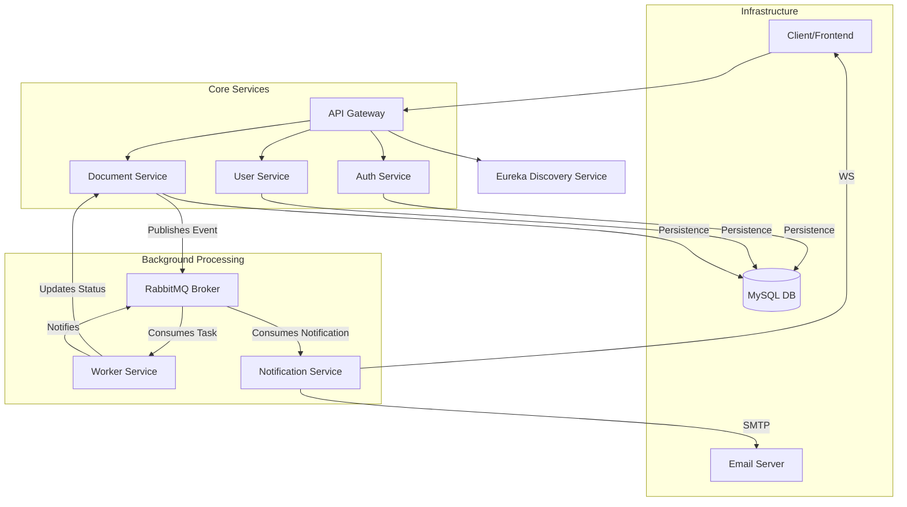

# Microservices Project - Document Processing System

A production-ready microservices architecture built with Spring Cloud, Docker, and RabbitMQ. This system handles secure user authentication, profile management, and asynchronous document processing (PDF to DOCX conversion).

## 🏗️ Architecture Overview

The project follows a decoupled, event-driven architecture where each service has a specific responsibility:



## 🚀 The Component Flow

### 1. Authentication & Security
- **Auth Service**: Manages user registration and login. It issues **JWT tokens** (Access & Refresh) and hashes passwords using BCrypt.
- **API Gateway**: Acts as the single entry point. It validates the JWT for every request and extracts the `username` and `roles`, passing them to downstream services via HTTP headers (`X-Auth-User`, `X-Auth-Roles`).
- **Downstream Services**: (e.g., User Service) use a `RoleFilter` to reconstruct the security context from headers, enabling role-based access control (`@PreAuthorize`).

### 2. User Management
- **User Service**: Handles profile CRUD operations. Access is restricted: only `ADMIN` can view all users, while `USER` and `PROCESSOR` roles have limited access.

### 3. Asynchronous Document Processing
This is the core workflow of the system:
1.  **Upload**: Client uploads a PDF to the `Document Service`.
2.  **Storage**: The service saves the file to a shared Windows volume and creates a record in MySQL with `UPLOADED` status.
3.  **Event**: It publishes a message containing the Document ID to the `document_process_queue`.
4.  **Processing**: The **Worker Service** consumes the message:
    - It updates the status to `PROCESSING` via the Document Service's internal API.
    - It extracts text using **Apache PDFBox**.
    - It generates a `.docx` file using **Apache POI**.
    - It updates the database with the extracted data (JSON) and sets status to `COMPLETED`.
5.  **Notification**: The Worker publishes an event to the `notification_queue`.
6.  **Delivery**: The **Notification Service** sends an email via SMTP and pushes a real-time update to the client via **WebSockets**.

## 🛠️ Technology Stack

| Category | Technology |
| :--- | :--- |
| **Framework** | Spring Boot 3.x, Spring Cloud (Gateway, Eureka, Feign) |
| **Security** | Spring Security, JWT (JJWT 0.12.5), BCrypt |
| **Messaging** | RabbitMQ |
| **Database** | MySQL 8.0 |
| **Document Tools** | Apache PDFBox, Apache POI |
| **DevOps** | Docker, Docker Compose, GitHub Actions |
| **Documentation** | Swagger / OpenAPI 3.0, Spring Boot Actuator |

## 🚦 Getting Started

### Prerequisites
- Java 17
- Maven
- Docker Desktop (Windows)

### Running Locally with Docker
1.  **Build the JARs**:
    ```bash
    mvn clean package -DskipTests
    ```
2.  **Start the Infrastructure**:
    ```bash
    docker-compose up --build
    ```
3.  **Access Points**:
    - **API Gateway**: `http://localhost:8080`
    - **Eureka Dashboard**: `http://localhost:8761`
    - **Swagger UI**: `http://localhost:8080/swagger-ui.html`
    - **RabbitMQ Admin**: `http://localhost:15672` (guest/guest)

## 🛡️ Security Implementation
The system uses a **Centralized Authentication, Decentralized Authorization** pattern.
- **Gateway** does the heavy lifting of token validation.
- **Microservices** do the fine-grained checks using the roles passed by the Gateway.
- All service-to-service communication within the Docker network is secured via the internal network.

## 📈 Monitoring
All services include **Spring Boot Actuator**.
- Health Check: `http://<service-url>/actuator/health`
- Metrics: `http://<service-url>/actuator/metrics`
